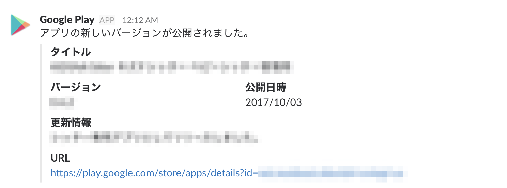
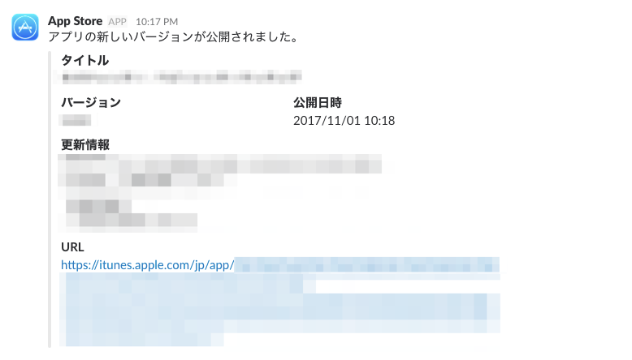

Nina
----

[](https://greenkeeper.io/)
[](https://circleci.com/gh/pine/Nina/tree/master) [](https://gemnasium.com/github.com/pine/Nina)
[](https://codeclimate.com/github/pine/Nina/maintainability)

:eyes: Check and notify app's latest version on App Store and Google Play

<a href="pr/android.png"></a>
<a href="pr/ios.png"></a>

## Requirements

- Node v`$(cat .node-version)`
- Yarn

## Running Locally

```
$ git clone https://github.com/pine/Nina.git
$ cd Nina
$ yarn
$ yarn start
```

## Deploying to Heroku

```
$ heroku create
$ git push heroku master
$ heroku open
```

## License
MIT &copy; Pinze Mizune
